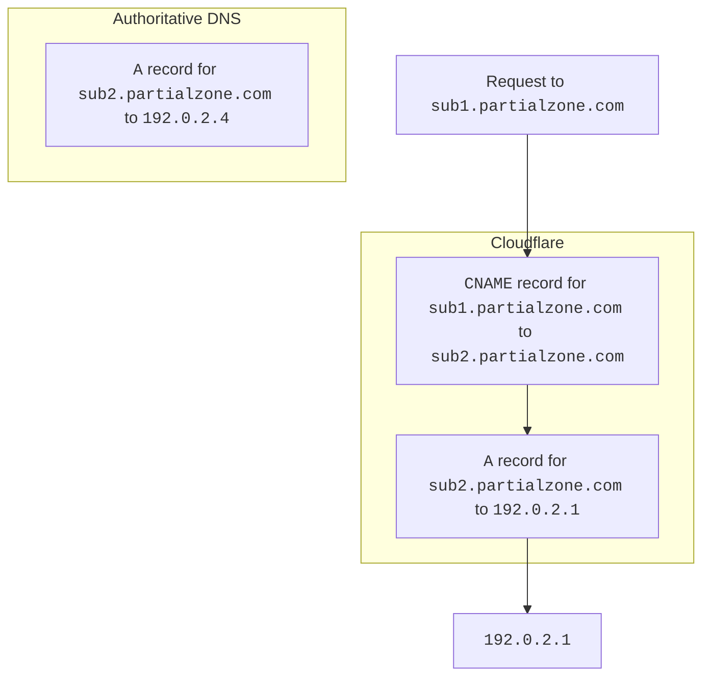
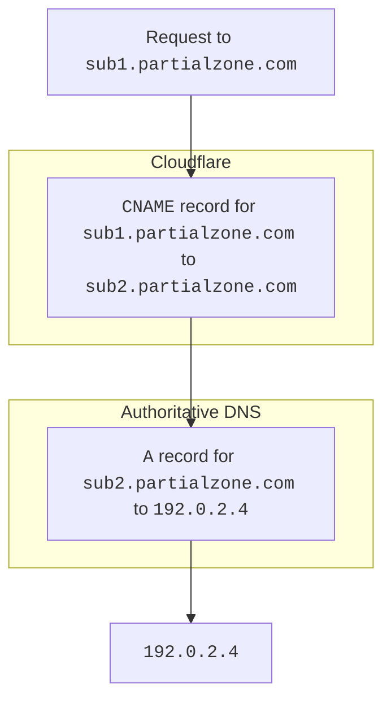
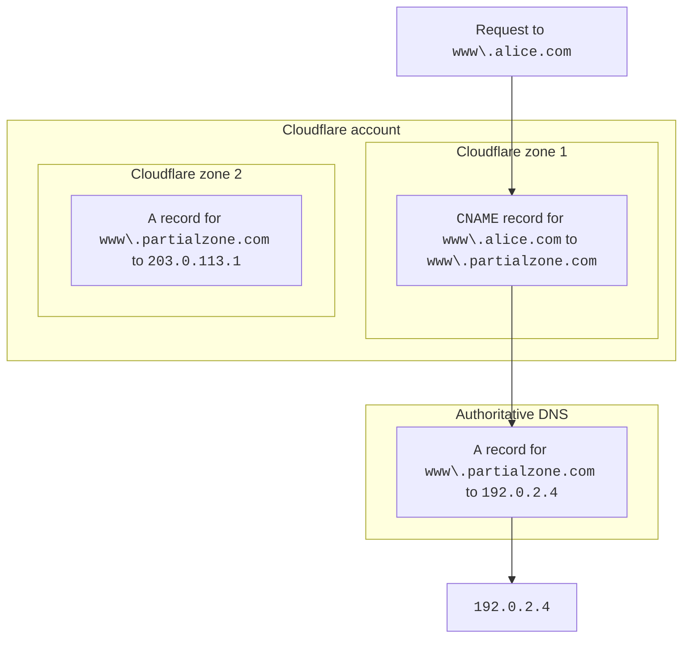
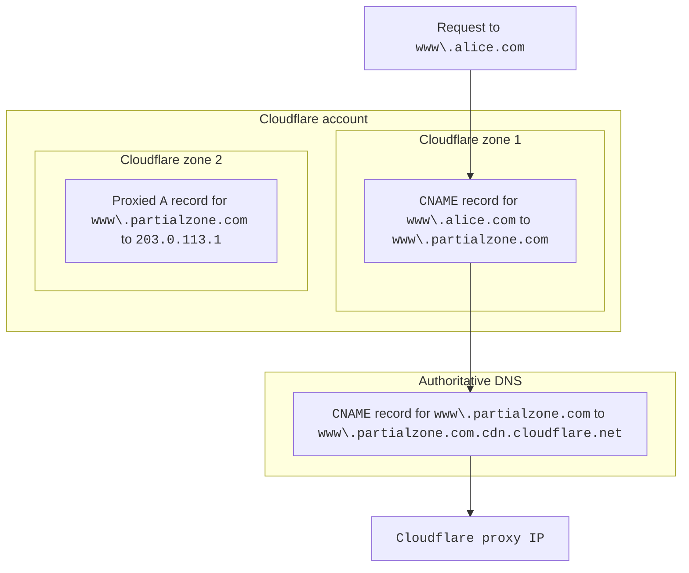

---
标题：DNS解析
pcx_content_type：参考
侧栏：
排序：11
头部：
- 标签：标题
内容：部分区域的DNS解析

---

import { 词汇提示 } from “~ / components”

当您拥有<GlossaryTooltip term="partial setup" link="/dns/zone-setups/partial-setup/">部分区域</GlossaryTooltip>时，Cloudflare 对 DNS 记录的处理方式与完整区域略有不同，以便在内部解析代理 HTTP 请求所发送到的源服务器。

## 同一区域内的记录

当您在部分区域中[创建新的 DNS 记录](/dns/manage-dns-records/how-to/create-dns-records/#create-dns-records)时，Cloudflare 会自动检查您的任何 CNAME 记录是否指向同一区域内的现有 A、AAAA 或 CNAME 记录。

例如，如果您部分区域中存在以下记录，Cloudflare 将显示警告：

```txt
sub1.partialzone.com   CNAME   sub2.partialzone.com
sub2.partialzone.com   A       192.0.2.1
```

Since Cloudflare contains both the CNAME and its target, our DNS resolution will send incoming HTTP requests to `sub1.partialzone.com` to the origin `192.0.2.1`.

This can cause issues if you already have DNS records for `sub2.partialzone.com` at your authoritative DNS provider. These records may point to `192.0.2.4`, another IP address, or another domain but - because Cloudflare contains the initial record and the target - it never queries your authoritative DNS provider for the record for `sub2.partialzone.com`.



<br />

When you avoid this situation - meaning you do not have the **target** of the CNAME record within your partial zone - this DNS resolution would happen differently.



***

## Records pointing to a partial zone within the same account

You could also [create a CNAME record](/dns/manage-dns-records/how-to/create-dns-records/#create-dns-records) in a zone (partial or full setup) that points to a record in another partial zone within your account.

In this case, Cloudflare will always resolve the CNAME target based on the value at your authoritative DNS provider of the partial target zone.



### Auth DNS points to `cdn.cloudflare.net`

Considering the following scenario:

- The target zone (Cloudflare zone 2 in this example) is a partial zone and the DNS record on the partial is proxied.
- The DNS record on the authoritative DNS server points to `cdn.cloudflare.net`

If such setup is in place, the subdomain (`www.partialzone.com` in this example) will resolve to a Cloudflare proxy IP, which will ultimately result in an error. Consider using [custom hostnames](/cloudflare-for-platforms/cloudflare-for-saas/domain-support/) and [Orange-to-Orange](/cloudflare-for-platforms/cloudflare-for-saas/saas-customers/how-it-works/) setup instead.


